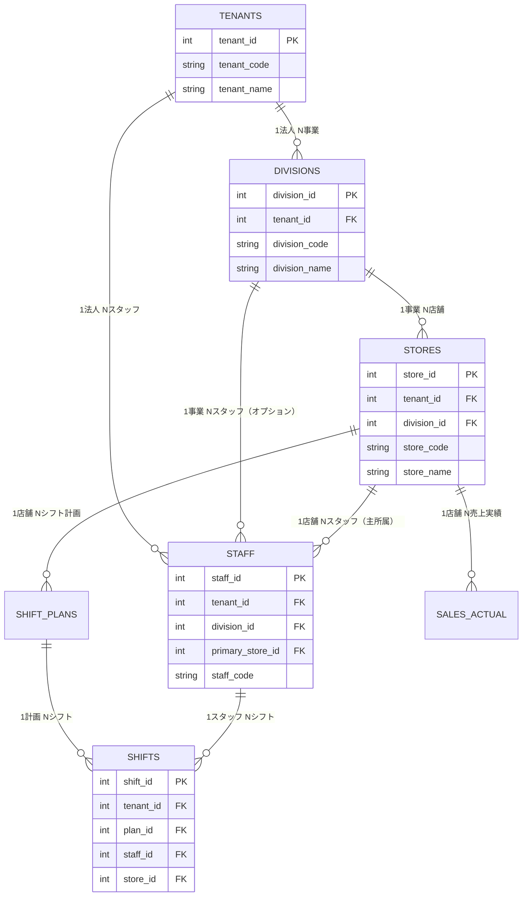

# マルチテナント対応データベース再設計

**作成日**: 2025-10-31
**ステータス**: ✅ **実装完了** - SQLスクリプト作成済み

**実装ファイル**:
- `scripts/db/005_create_multitenant_schema.sql` - マルチテナントスキーマDDL
- `scripts/db/006_migrate_to_multitenant.sql` - 既存データ移行スクリプト
- `scripts/db/007_setup_rls_policies.sql` - Row Level Security設定
- `scripts/db/setup_multitenant.sh` - 一括セットアップスクリプト

---

## 🔍 現行設計の問題点分析

### ❌ **問題1: テナント・事業層が存在しない**

現行設計は **単一法人・直接店舗** を前提としており、以下の階層構造に対応できません:

```
❌ 現行: stores テーブルのみ（階層なし）
✅ 必要: tenant（法人） → division（事業） → store（店舗）
```

### ❌ **問題2: tenant_id がどのテーブルにも存在しない**

- `stores`, `staff`, `shifts`, `sales_actual` 等、主要テーブルに `tenant_id` がない
- テナント境界を設定できず、データ分離が不可能
- マルチテナントSaaSとして機能しない

### ❌ **問題3: スキーマ分割が存在しない**

- すべてのテーブルが `public` スキーマに配置
- 機能ドメイン別の論理分離ができていない
- 将来的な拡張性・保守性に課題

### ❌ **問題4: マスターデータの共有/分離が不明確**

- `roles`, `skills`, `certifications` 等のマスターデータ
- テナント共通マスタ vs テナント独自マスタの区別がない
- C社のような複数事業でのマスタ共有・分離ができない

---

## ✅ 再設計案: マルチテナント3層階層構造

### **設計方針**

1. **tenant → division → store の3層階層を実現**
2. **全テーブルに適切な tenant_id を配置**（親からの継承で重複を避ける）
3. **スキーマを機能ドメイン別に分割**
4. **マスターデータの共有/分離を明確化**
5. **Row Level Security (RLS) でテナント分離を実現**

---

## 📐 新スキーマ設計

### **スキーマ構成（5スキーマ）**

```sql
-- 機能ドメイン別スキーマ分割
CREATE SCHEMA IF NOT EXISTS core;      -- コアマスタ（テナント、事業、店舗）
CREATE SCHEMA IF NOT EXISTS ops;       -- 運用データ（シフト、勤怠）
CREATE SCHEMA IF NOT EXISTS hr;        -- 人事データ（スタッフ、給与）
CREATE SCHEMA IF NOT EXISTS analytics; -- 分析データ（実績、予測）
CREATE SCHEMA IF NOT EXISTS audit;     -- 監査ログ（履歴、変更追跡）
```

**メリット**:
- 機能別にテーブルを整理
- 権限管理が容易（スキーマ単位でGRANT）
- マイグレーション影響範囲の局所化

---

## 📊 テーブル設計

### **1. core スキーマ（コアマスタ）**

#### 1.1 tenants（法人マスタ）★NEW

```sql
CREATE TABLE core.tenants (
    tenant_id SERIAL PRIMARY KEY,
    tenant_code VARCHAR(50) UNIQUE NOT NULL,
    tenant_name VARCHAR(200) NOT NULL,
    corporate_number VARCHAR(13), -- 法人番号
    contract_plan VARCHAR(50) NOT NULL DEFAULT 'STANDARD', -- FREE/STANDARD/PREMIUM/ENTERPRISE
    contract_start_date DATE NOT NULL,
    contract_end_date DATE,
    max_divisions INT DEFAULT 10,
    max_stores INT DEFAULT 100,
    max_staff INT DEFAULT 1000,
    billing_email VARCHAR(255),
    admin_email VARCHAR(255) NOT NULL,
    timezone VARCHAR(50) DEFAULT 'Asia/Tokyo',
    locale VARCHAR(10) DEFAULT 'ja_JP',
    is_active BOOLEAN NOT NULL DEFAULT TRUE,
    created_at TIMESTAMP NOT NULL DEFAULT CURRENT_TIMESTAMP,
    updated_at TIMESTAMP NOT NULL DEFAULT CURRENT_TIMESTAMP
);

COMMENT ON TABLE core.tenants IS '法人マスタ（マルチテナントの最上位層）';
COMMENT ON COLUMN core.tenants.contract_plan IS '契約プラン（FREE/STANDARD/PREMIUM/ENTERPRISE）';
COMMENT ON COLUMN core.tenants.max_divisions IS '作成可能な事業数上限';

CREATE INDEX idx_tenants_code ON core.tenants(tenant_code);
CREATE INDEX idx_tenants_active ON core.tenants(is_active);
```

#### 1.2 divisions（事業マスタ）★NEW

```sql
CREATE TABLE core.divisions (
    division_id SERIAL PRIMARY KEY,
    tenant_id INT NOT NULL, -- ★tenant_id 追加
    division_code VARCHAR(50) NOT NULL,
    division_name VARCHAR(200) NOT NULL,
    division_type VARCHAR(50), -- RESTAURANT/RETAIL/SERVICE/OTHER
    industry_code VARCHAR(20), -- 業種コード
    head_office_address VARCHAR(500),
    representative_name VARCHAR(100),
    business_description TEXT,
    parent_division_id INT, -- 事業部階層（オプション）
    display_order INT NOT NULL DEFAULT 0,
    is_active BOOLEAN NOT NULL DEFAULT TRUE,
    created_at TIMESTAMP NOT NULL DEFAULT CURRENT_TIMESTAMP,
    updated_at TIMESTAMP NOT NULL DEFAULT CURRENT_TIMESTAMP,
    UNIQUE (tenant_id, division_code),
    FOREIGN KEY (tenant_id) REFERENCES core.tenants(tenant_id) ON DELETE CASCADE,
    FOREIGN KEY (parent_division_id) REFERENCES core.divisions(division_id) ON DELETE SET NULL
);

COMMENT ON TABLE core.divisions IS '事業マスタ（複数事業を持つ法人に対応）';
COMMENT ON COLUMN core.divisions.division_type IS '事業タイプ（RESTAURANT/RETAIL/SERVICE等）';

CREATE INDEX idx_divisions_tenant ON core.divisions(tenant_id);
CREATE INDEX idx_divisions_code ON core.divisions(tenant_id, division_code);
CREATE INDEX idx_divisions_active ON core.divisions(tenant_id, is_active);
```

#### 1.3 stores（店舗マスタ）★修正

```sql
CREATE TABLE core.stores (
    store_id SERIAL PRIMARY KEY,
    tenant_id INT NOT NULL, -- ★tenant_id 追加
    division_id INT NOT NULL, -- ★division_id 追加
    store_code VARCHAR(50) NOT NULL,
    store_name VARCHAR(200) NOT NULL,
    store_type VARCHAR(50), -- HEAD_OFFICE/BRANCH/FRANCHISE
    address VARCHAR(500),
    latitude DECIMAL(10,8),
    longitude DECIMAL(11,8),
    phone_number VARCHAR(20),
    email VARCHAR(255),
    business_hours_start TIME DEFAULT '09:00',
    business_hours_end TIME DEFAULT '22:00',
    floor_area_sqm DECIMAL(10,2),
    seat_count INT,
    parking_spaces INT,
    opening_date DATE,
    closing_date DATE,
    manager_staff_id INT, -- 店長（後から外部キー設定）
    display_order INT NOT NULL DEFAULT 0,
    is_active BOOLEAN NOT NULL DEFAULT TRUE,
    created_at TIMESTAMP NOT NULL DEFAULT CURRENT_TIMESTAMP,
    updated_at TIMESTAMP NOT NULL DEFAULT CURRENT_TIMESTAMP,
    UNIQUE (tenant_id, division_id, store_code),
    FOREIGN KEY (tenant_id) REFERENCES core.tenants(tenant_id) ON DELETE CASCADE,
    FOREIGN KEY (division_id) REFERENCES core.divisions(division_id) ON DELETE CASCADE
);

COMMENT ON TABLE core.stores IS '店舗マスタ（3層階層の最下層）';
COMMENT ON COLUMN core.stores.tenant_id IS '法人ID（RLS用）';
COMMENT ON COLUMN core.stores.division_id IS '事業ID';

CREATE INDEX idx_stores_tenant ON core.stores(tenant_id);
CREATE INDEX idx_stores_division ON core.stores(tenant_id, division_id);
CREATE INDEX idx_stores_code ON core.stores(tenant_id, store_code);
CREATE INDEX idx_stores_active ON core.stores(tenant_id, is_active);
```

---

### **2. hr スキーマ（人事データ）**

#### 2.1 staff（スタッフマスタ）★修正

```sql
CREATE TABLE hr.staff (
    staff_id SERIAL PRIMARY KEY,
    tenant_id INT NOT NULL, -- ★tenant_id 追加
    division_id INT, -- 事業所属（NULL=全社共通）
    primary_store_id INT NOT NULL, -- 主所属店舗
    staff_code VARCHAR(50) NOT NULL,
    name VARCHAR(100) NOT NULL,
    name_kana VARCHAR(200),
    role_id INT NOT NULL,
    email VARCHAR(255),
    phone_number VARCHAR(20),
    hire_date DATE,
    birth_date DATE,
    employment_type VARCHAR(20) NOT NULL DEFAULT 'hourly',
    employment_status VARCHAR(20) NOT NULL DEFAULT 'ACTIVE', -- ACTIVE/LEAVE/RETIRED
    hourly_rate DECIMAL(10,2),
    monthly_salary DECIMAL(10,2),
    contract_fee DECIMAL(10,2),
    daily_cost DECIMAL(10,2) NOT NULL DEFAULT 0,
    max_hours_per_week DECIMAL(5,2) NOT NULL DEFAULT 40,
    min_hours_per_week DECIMAL(5,2) NOT NULL DEFAULT 0,
    max_consecutive_days INT NOT NULL DEFAULT 6,
    skill_level INT NOT NULL DEFAULT 1,
    commute_distance_km DECIMAL(5,2) DEFAULT 0,
    has_social_insurance BOOLEAN NOT NULL DEFAULT FALSE,
    is_active BOOLEAN NOT NULL DEFAULT TRUE,
    created_at TIMESTAMP NOT NULL DEFAULT CURRENT_TIMESTAMP,
    updated_at TIMESTAMP NOT NULL DEFAULT CURRENT_TIMESTAMP,
    UNIQUE (tenant_id, staff_code),
    FOREIGN KEY (tenant_id) REFERENCES core.tenants(tenant_id) ON DELETE CASCADE,
    FOREIGN KEY (division_id) REFERENCES core.divisions(division_id) ON DELETE SET NULL,
    FOREIGN KEY (primary_store_id) REFERENCES core.stores(store_id),
    FOREIGN KEY (role_id) REFERENCES hr.roles(role_id)
);

COMMENT ON TABLE hr.staff IS 'スタッフマスタ（テナント分離対応）';
COMMENT ON COLUMN hr.staff.tenant_id IS '法人ID（RLS用）';
COMMENT ON COLUMN hr.staff.division_id IS '事業所属（NULL=全社共通スタッフ）';

CREATE INDEX idx_staff_tenant ON hr.staff(tenant_id);
CREATE INDEX idx_staff_division ON hr.staff(tenant_id, division_id);
CREATE INDEX idx_staff_store ON hr.staff(tenant_id, primary_store_id);
CREATE INDEX idx_staff_code ON hr.staff(tenant_id, staff_code);
CREATE INDEX idx_staff_active ON hr.staff(tenant_id, is_active);
```

#### 2.2 staff_store_assignments（スタッフ兼務管理）★NEW

```sql
CREATE TABLE hr.staff_store_assignments (
    assignment_id SERIAL PRIMARY KEY,
    tenant_id INT NOT NULL,
    staff_id INT NOT NULL,
    store_id INT NOT NULL,
    assignment_type VARCHAR(20) NOT NULL DEFAULT 'REGULAR', -- PRIMARY/REGULAR/SUPPORT/TEMPORARY
    start_date DATE NOT NULL,
    end_date DATE,
    is_active BOOLEAN NOT NULL DEFAULT TRUE,
    created_at TIMESTAMP NOT NULL DEFAULT CURRENT_TIMESTAMP,
    updated_at TIMESTAMP NOT NULL DEFAULT CURRENT_TIMESTAMP,
    UNIQUE (tenant_id, staff_id, store_id, start_date),
    FOREIGN KEY (tenant_id) REFERENCES core.tenants(tenant_id) ON DELETE CASCADE,
    FOREIGN KEY (staff_id) REFERENCES hr.staff(staff_id) ON DELETE CASCADE,
    FOREIGN KEY (store_id) REFERENCES core.stores(store_id) ON DELETE CASCADE
);

COMMENT ON TABLE hr.staff_store_assignments IS 'スタッフ兼務管理（複数店舗勤務対応）';

CREATE INDEX idx_assignments_tenant ON hr.staff_store_assignments(tenant_id);
CREATE INDEX idx_assignments_staff ON hr.staff_store_assignments(tenant_id, staff_id);
CREATE INDEX idx_assignments_store ON hr.staff_store_assignments(tenant_id, store_id);
```

---

### **3. ops スキーマ（運用データ）**

#### 3.1 shift_plans（シフト計画）★修正

```sql
CREATE TABLE ops.shift_plans (
    plan_id SERIAL PRIMARY KEY,
    tenant_id INT NOT NULL, -- ★tenant_id 追加
    store_id INT NOT NULL,
    plan_year INT NOT NULL,
    plan_month INT NOT NULL,
    plan_type VARCHAR(20) NOT NULL DEFAULT 'FIRST',
    status VARCHAR(20) NOT NULL DEFAULT 'DRAFT',
    total_labor_cost DECIMAL(12,2) DEFAULT 0,
    total_work_hours DECIMAL(10,2) DEFAULT 0,
    created_by INT,
    approved_by INT,
    approved_at TIMESTAMP,
    published_at TIMESTAMP,
    is_active BOOLEAN NOT NULL DEFAULT TRUE,
    created_at TIMESTAMP NOT NULL DEFAULT CURRENT_TIMESTAMP,
    updated_at TIMESTAMP NOT NULL DEFAULT CURRENT_TIMESTAMP,
    UNIQUE (tenant_id, store_id, plan_year, plan_month, plan_type),
    FOREIGN KEY (tenant_id) REFERENCES core.tenants(tenant_id) ON DELETE CASCADE,
    FOREIGN KEY (store_id) REFERENCES core.stores(store_id),
    FOREIGN KEY (created_by) REFERENCES hr.staff(staff_id),
    FOREIGN KEY (approved_by) REFERENCES hr.staff(staff_id)
);

CREATE INDEX idx_shift_plans_tenant ON ops.shift_plans(tenant_id);
CREATE INDEX idx_shift_plans_store ON ops.shift_plans(tenant_id, store_id);
```

#### 3.2 shifts（シフト）★修正

```sql
CREATE TABLE ops.shifts (
    shift_id SERIAL PRIMARY KEY,
    tenant_id INT NOT NULL, -- ★tenant_id 追加
    plan_id INT NOT NULL,
    staff_id INT NOT NULL,
    store_id INT NOT NULL, -- ★店舗を明示（兼務対応）
    shift_date DATE NOT NULL,
    pattern_id INT,
    start_time TIME NOT NULL,
    end_time TIME NOT NULL,
    break_minutes INT NOT NULL DEFAULT 0,
    total_hours DECIMAL(5,2) NOT NULL,
    labor_cost DECIMAL(10,2) NOT NULL DEFAULT 0,
    assigned_skills JSONB DEFAULT '[]',
    is_preferred BOOLEAN NOT NULL DEFAULT FALSE,
    is_modified BOOLEAN NOT NULL DEFAULT FALSE,
    modified_reason TEXT,
    notes TEXT,
    is_active BOOLEAN NOT NULL DEFAULT TRUE,
    created_at TIMESTAMP NOT NULL DEFAULT CURRENT_TIMESTAMP,
    updated_at TIMESTAMP NOT NULL DEFAULT CURRENT_TIMESTAMP,
    FOREIGN KEY (tenant_id) REFERENCES core.tenants(tenant_id) ON DELETE CASCADE,
    FOREIGN KEY (plan_id) REFERENCES ops.shift_plans(plan_id) ON DELETE CASCADE,
    FOREIGN KEY (staff_id) REFERENCES hr.staff(staff_id),
    FOREIGN KEY (store_id) REFERENCES core.stores(store_id),
    FOREIGN KEY (pattern_id) REFERENCES ops.shift_patterns(pattern_id)
);

CREATE INDEX idx_shifts_tenant ON ops.shifts(tenant_id);
CREATE INDEX idx_shifts_plan ON ops.shifts(tenant_id, plan_id);
CREATE INDEX idx_shifts_staff ON ops.shifts(tenant_id, staff_id);
CREATE INDEX idx_shifts_store ON ops.shifts(tenant_id, store_id);
CREATE INDEX idx_shifts_date ON ops.shifts(tenant_id, shift_date);
```

---

### **4. analytics スキーマ（分析データ）**

#### 4.1 sales_actual（売上実績）★修正

```sql
CREATE TABLE analytics.sales_actual (
    actual_id SERIAL PRIMARY KEY,
    tenant_id INT NOT NULL, -- ★tenant_id 追加
    store_id INT NOT NULL,
    actual_date DATE NOT NULL,
    sales_amount DECIMAL(12,2) NOT NULL DEFAULT 0,
    customer_count INT NOT NULL DEFAULT 0,
    average_spend DECIMAL(10,2) DEFAULT 0,
    weather VARCHAR(50),
    temperature DECIMAL(5,2),
    is_holiday BOOLEAN NOT NULL DEFAULT FALSE,
    notes TEXT,
    is_active BOOLEAN NOT NULL DEFAULT TRUE,
    created_at TIMESTAMP NOT NULL DEFAULT CURRENT_TIMESTAMP,
    updated_at TIMESTAMP NOT NULL DEFAULT CURRENT_TIMESTAMP,
    UNIQUE (tenant_id, store_id, actual_date),
    FOREIGN KEY (tenant_id) REFERENCES core.tenants(tenant_id) ON DELETE CASCADE,
    FOREIGN KEY (store_id) REFERENCES core.stores(store_id) ON DELETE CASCADE
);

CREATE INDEX idx_sales_tenant ON analytics.sales_actual(tenant_id);
CREATE INDEX idx_sales_store ON analytics.sales_actual(tenant_id, store_id);
CREATE INDEX idx_sales_date ON analytics.sales_actual(tenant_id, actual_date);
```

---

### **5. audit スキーマ（監査ログ）**

#### 5.1 audit_logs（統合監査ログ）★NEW

```sql
CREATE TABLE audit.audit_logs (
    log_id BIGSERIAL PRIMARY KEY,
    tenant_id INT NOT NULL,
    schema_name VARCHAR(50) NOT NULL,
    table_name VARCHAR(100) NOT NULL,
    record_id BIGINT,
    operation VARCHAR(20) NOT NULL, -- INSERT/UPDATE/DELETE
    changed_by INT,
    changed_at TIMESTAMP NOT NULL DEFAULT CURRENT_TIMESTAMP,
    old_values JSONB,
    new_values JSONB,
    change_reason TEXT,
    ip_address INET,
    user_agent TEXT
);

CREATE INDEX idx_audit_tenant ON audit.audit_logs(tenant_id);
CREATE INDEX idx_audit_table ON audit.audit_logs(tenant_id, schema_name, table_name);
CREATE INDEX idx_audit_date ON audit.audit_logs(tenant_id, changed_at);
CREATE INDEX idx_audit_user ON audit.audit_logs(tenant_id, changed_by);
```

---

## 🔒 Row Level Security (RLS) 設定

### **RLS有効化とポリシー設定**

```sql
-- RLS有効化
ALTER TABLE core.tenants ENABLE ROW LEVEL SECURITY;
ALTER TABLE core.divisions ENABLE ROW LEVEL SECURITY;
ALTER TABLE core.stores ENABLE ROW LEVEL SECURITY;
ALTER TABLE hr.staff ENABLE ROW LEVEL SECURITY;
ALTER TABLE ops.shift_plans ENABLE ROW LEVEL SECURITY;
ALTER TABLE ops.shifts ENABLE ROW LEVEL SECURITY;
ALTER TABLE analytics.sales_actual ENABLE ROW LEVEL SECURITY;

-- テナント分離ポリシー（例: stores）
CREATE POLICY tenant_isolation_stores ON core.stores
    USING (tenant_id = current_setting('app.current_tenant_id')::INT);

-- スーパーユーザーは全テナント参照可能
CREATE POLICY superuser_all_stores ON core.stores
    USING (current_setting('app.is_superuser', TRUE)::BOOLEAN = TRUE);

-- 同様のポリシーを全テーブルに適用
```

**メリット**:
- アプリケーションコード不要でテナント分離
- セッション変数でテナントIDを設定するだけ
- セキュリティリスク低減

---

## 📋 マスターデータの共有/分離設計

### **テナント共通マスタ（shared）**

```sql
-- 全テナント共通のマスターデータ
CREATE TABLE shared.roles (
    role_id SERIAL PRIMARY KEY,
    role_code VARCHAR(50) UNIQUE NOT NULL,
    role_name VARCHAR(100) NOT NULL,
    ...
);

CREATE TABLE shared.skills (
    skill_id SERIAL PRIMARY KEY,
    skill_code VARCHAR(50) UNIQUE NOT NULL,
    skill_name VARCHAR(100) NOT NULL,
    ...
);

CREATE TABLE shared.certifications (
    certification_id SERIAL PRIMARY KEY,
    certification_code VARCHAR(50) UNIQUE NOT NULL,
    certification_name VARCHAR(200) NOT NULL,
    ...
);
```

### **テナント独自マスタ（tenant-specific）**

```sql
-- テナント独自のマスターデータ
CREATE TABLE core.tenant_roles (
    tenant_role_id SERIAL PRIMARY KEY,
    tenant_id INT NOT NULL,
    role_code VARCHAR(50) NOT NULL,
    role_name VARCHAR(100) NOT NULL,
    UNIQUE (tenant_id, role_code),
    FOREIGN KEY (tenant_id) REFERENCES core.tenants(tenant_id) ON DELETE CASCADE
);

-- 使用時は共通マスタ OR テナント独自マスタを選択
```

---

## 🎯 マイグレーション戦略

### **フェーズ1: スキーマ作成**

```sql
-- 新スキーマ作成
CREATE SCHEMA core;
CREATE SCHEMA ops;
CREATE SCHEMA hr;
CREATE SCHEMA analytics;
CREATE SCHEMA audit;
CREATE SCHEMA shared;
```

### **フェーズ2: テナント・事業テーブル追加**

```sql
-- core.tenants, core.divisions 作成
-- 既存データを tenant_id=1（デフォルトテナント）に移行
```

### **フェーズ3: 既存テーブルの移行**

```sql
-- public.stores → core.stores（tenant_id追加）
-- public.staff → hr.staff（tenant_id追加）
-- public.shifts → ops.shifts（tenant_id追加）
-- 以下同様
```

### **フェーズ4: RLS有効化**

```sql
-- RLSポリシー設定
-- アプリケーションコード修正
```

---

## 📊 ER図（概念図）



---

## ✅ 確認事項への回答

### 1. ✅ 階層構造の対応状況

**現状**: ❌ `stores` のみで階層なし
**修正案**: ✅ `tenants` → `divisions` → `stores` の3層実現

### 2. ✅ テナント境界の扱い

**現状**: ❌ `tenant_id` が存在しない
**修正案**: ✅ 全主要テーブルに `tenant_id` 追加、RLSで分離

### 3. ✅ スキーマ構成

**現状**: ❌ すべて `public` スキーマ
**修正案**: ✅ 機能ドメイン別（core/ops/hr/analytics/audit/shared）

### 4. ✅ 拡張性とマイグレーション

**現状**: ❌ テナント追加時にスキーマ追加が必要になる恐れ
**修正案**: ✅ データ追加のみでOK、スキーマ追加不要

---

## 🚀 実装方法（セットアップガイド）

### **方法1: 一括セットアップスクリプト（推奨）**

```bash
# Railway環境で実行
cd shift-scheduler-ai
chmod +x scripts/db/setup_multitenant.sh
railway run ./scripts/db/setup_multitenant.sh
```

**実行モード選択**:
1. **フルセットアップ（新規構築）** - 005 + 007を実行
2. **既存データ移行** - 005 + 006 + 007を実行（既に001-004実行済みの場合）
3. **RLSのみ設定** - 007のみ実行（既に005実行済みの場合）

### **方法2: 個別スクリプト実行**

```bash
# ステップ1: マルチテナントスキーマ作成（31テーブル）
railway run psql $DATABASE_URL -f scripts/db/005_create_multitenant_schema.sql

# ステップ2: 既存データ移行（オプション - 001-004実行済みの場合のみ）
railway run psql $DATABASE_URL -f scripts/db/006_migrate_to_multitenant.sql

# ステップ3: Row Level Security (RLS) 設定
railway run psql $DATABASE_URL -f scripts/db/007_setup_rls_policies.sql
```

---

## 📊 構築後の確認

### **スキーマ確認**

```sql
-- スキーマ一覧
SELECT schema_name FROM information_schema.schemata
WHERE schema_name IN ('core', 'ops', 'hr', 'analytics', 'audit');

-- テーブル数確認
SELECT
    table_schema,
    COUNT(*) as table_count
FROM information_schema.tables
WHERE table_schema IN ('core', 'ops', 'hr', 'analytics', 'audit')
GROUP BY table_schema
ORDER BY table_schema;
```

**期待される結果**:
- core: 7テーブル
- hr: 8テーブル
- ops: 11テーブル
- analytics: 4テーブル
- audit: 3テーブル
- **合計: 33テーブル**

### **RLS動作確認**

```sql
-- テスト1: tenant_id=1 でログイン
SELECT set_current_tenant(1);
SELECT tenant_id, tenant_name FROM core.tenants;  -- 1件のみ表示

-- テスト2: 店舗データ確認
SELECT store_id, store_name FROM core.stores;  -- tenant_id=1の店舗のみ

-- テスト3: テナント切替
SELECT set_current_tenant(2);
SELECT * FROM core.stores;  -- 別のテナントのデータに切り替わる
```

---

## 🔧 アプリケーション連携

### **バックエンドAPI実装例（Node.js/Express）**

```javascript
// backend/src/db/connection.js
import pg from 'pg';
const { Pool } = pg;

const pool = new Pool({
  connectionString: process.env.DATABASE_URL,
});

// テナントコンテキスト設定ミドルウェア
export async function setTenantContext(req, res, next) {
  const tenantId = req.user?.tenantId; // JWTトークンから取得

  if (!tenantId) {
    return res.status(401).json({ error: 'Tenant ID not found' });
  }

  const client = await pool.connect();
  try {
    // セッション変数にテナントIDを設定
    await client.query('SELECT set_current_tenant($1)', [tenantId]);
    req.dbClient = client;
    next();
  } catch (error) {
    client.release();
    return res.status(500).json({ error: 'Failed to set tenant context' });
  }
}

// クリーンアップミドルウェア
export function releaseTenantContext(req, res, next) {
  if (req.dbClient) {
    req.dbClient.release();
  }
  next();
}
```

### **APIルート使用例**

```javascript
// backend/src/routes/stores.js
import express from 'express';
import { setTenantContext, releaseTenantContext } from '../db/connection.js';

const router = express.Router();

// 店舗一覧取得（自動的にテナント分離される）
router.get('/stores',
  setTenantContext,
  async (req, res) => {
    try {
      const result = await req.dbClient.query(`
        SELECT store_id, store_name, address
        FROM core.stores
        WHERE is_active = true
        ORDER BY store_name
      `);

      res.json(result.rows);
    } catch (error) {
      console.error('Error fetching stores:', error);
      res.status(500).json({ error: 'Failed to fetch stores' });
    }
  },
  releaseTenantContext
);

export default router;
```

---

## 🎯 次のステップ

1. ✅ **DDL作成** - 完了（005_create_multitenant_schema.sql）
2. ✅ **マイグレーションスクリプト** - 完了（006_migrate_to_multitenant.sql）
3. ✅ **RLS設定** - 完了（007_setup_rls_policies.sql）
4. 📝 **アプリケーション修正** - バックエンドAPIでセッション変数設定を実装
5. 🧪 **テスト** - マルチテナント動作確認とE2Eテスト

---

## 📚 関連ドキュメント

| ドキュメント | 内容 |
|-------------|------|
| [DATABASE_COMPLETE.md](DATABASE_COMPLETE.md) | 既存のシングルテナント構成（001-004） |
| [scripts/db/README.md](../scripts/db/README.md) | SQLスクリプト一覧とクイックスタート |
| [ARCHITECTURE.md](ARCHITECTURE.md) | システム全体アーキテクチャ |

---

## 🎉 まとめ

この再設計により、以下を実現しました:

✅ **3層階層構造**: tenant → division → store に完全対応
✅ **テナント境界**: 全テーブルにtenant_id追加、RLSで自動分離
✅ **スキーマ分割**: 機能ドメイン別（core/ops/hr/analytics/audit）
✅ **拡張性**: テナント追加時もデータ追加のみ、スキーマ変更不要
✅ **セキュリティ**: Row Level Securityによる自動データ分離

**C社のような複雑な階層構造に完全対応できます。**
