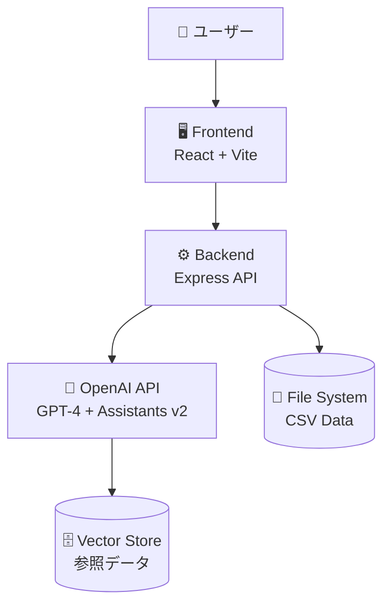
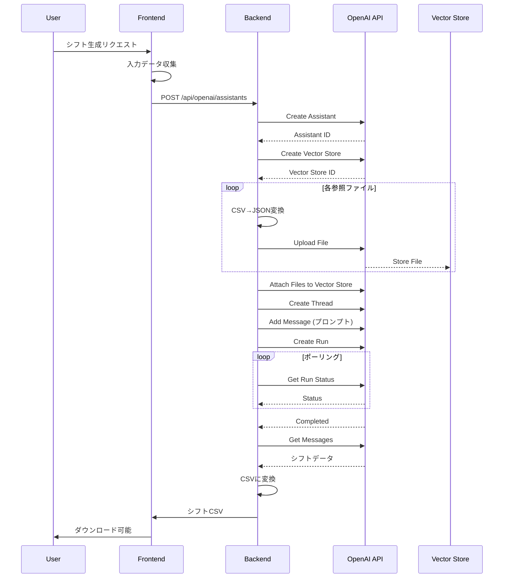

# アーキテクチャドキュメント

## 概要

このプロジェクトは、OpenAI GPT-4を活用したAIシフト自動生成システムです。
フロントエンド（React）とバックエンド（Express）で構成され、OpenAI Assistants API v2を使用してシフトを生成します。

## システム構成図



## ディレクトリ構造

```
shift-scheduler-ai/
├── frontend/                    # フロントエンド
│   ├── src/
│   │   ├── components/          # Reactコンポーネント
│   │   │   ├── ui/              # UIプリミティブ(shadcn/ui)
│   │   │   ├── shared/          # 共有コンポーネント
│   │   │   └── screens/         # 画面コンポーネント
│   │   ├── utils/               # ユーティリティ関数
│   │   │   ├── openaiClient.js  # OpenAI Chat Completion API
│   │   │   ├── assistantClient.js  # OpenAI Assistants API
│   │   │   ├── shiftValidator.js    # シフト検証
│   │   │   └── shiftInputCollector.js  # 入力データ収集
│   │   ├── dev/                 # 開発ツール
│   │   │   └── DevTools.jsx     # AIシフト生成UI
│   │   ├── config/              # 設定ファイル (新規)
│   │   │   └── default.js       # デフォルト設定
│   │   └── App.jsx              # ルートコンポーネント
│   ├── public/
│   │   └── data/                # データファイル
│   │       ├── master/          # マスタデータ(CSV)
│   │       ├── history/         # 履歴データ(CSV)
│   │       └── generated/       # 生成されたシフト(CSV)
│   ├── .env.example             # 環境変数テンプレート
│   ├── .prettierrc              # Prettier設定
│   ├── eslint.config.js         # ESLint設定
│   └── vite.config.js           # Vite設定
│
├── backend/                     # バックエンド (新規分離)
│   ├── src/
│   │   └── server.js            # Express APIサーバー
│   ├── .env                     # 環境変数
│   └── package.json
│
├── fixtures/                    # テストデータ
│   └── demo_data/               # デモ用データ
│
├── docs/                        # ドキュメント
│   ├── ARCHITECTURE.md          # このファイル
│   └── CONFIGURATION.md         # 設定ガイド
│
├── scripts/                     # ユーティリティスクリプト
│   └── refactor.sh              # リファクタリング自動化
│
├── .gitignore
├── SECURITY.md                  # セキュリティポリシー
└── README.md

```

## データフロー

### 1. シフト生成フロー



### 2. API通信フロー

**フロントエンド → バックエンド → OpenAI**

すべてのOpenAI API呼び出しはバックエンド経由で行われます（セキュリティのため）。

## 主要コンポーネント

### Frontend

#### `DevTools.jsx`
- **役割**: AI シフト生成のメイン画面
- **機能**:
  - Vector Store セットアップ
  - シフト生成パラメータ入力
  - AI シフト生成実行
  - 生成結果の表示・ダウンロード
- **状態管理**: React hooks (useState, useEffect)

#### `assistantClient.js`
- **役割**: OpenAI Assistants API v2 のクライアント
- **主要関数**:
  - `setupVectorStore()`: 参照ファイルのアップロードとVector Store作成
  - `generateShiftWithAssistant()`: Assistant を使用したシフト生成
  - `uploadFile()`: CSVファイルのアップロード（CSV→JSON変換込み）

#### `openaiClient.js`
- **役割**: OpenAI Chat Completion API のクライアント
- **使用場面**: 簡易的なシフト生成（Vector Store不使用）

#### `shiftValidator.js`
- **役割**: 生成されたシフトの検証
- **検証項目**:
  - 労働基準法遵守
  - 店舗制約チェック
  - スタッフスキルマッチング

### Backend

#### `server.js`
- **役割**: OpenAI API プロキシサーバー
- **主要エンドポイント**:
  - `POST /api/openai/assistants` - Assistant作成
  - `POST /api/openai/vector_stores` - Vector Store作成
  - `POST /api/openai/files` - ファイルアップロード（CSV→JSON変換）
  - `POST /api/openai/threads` - Thread作成
  - `POST /api/openai/threads/:threadId/runs` - Run作成・実行
  - `GET /api/openai/threads/:threadId/runs/:runId` - Run状態取得
  - `POST /api/save-csv` - 生成CSVの保存

**特徴**:
- すべてのリクエストでOpenAI APIキーを隠蔽
- CSV→JSON変換を自動実行（Vector Storeはjsonのみサポート）
- CORS設定でフロントエンドからのアクセスを許可

## 設定管理

### 環境変数（`.env`）

```bash
VITE_OPENAI_API_KEY=sk-proj-...
VITE_OPENAI_MODEL=gpt-4
VITE_OPENAI_MAX_TOKENS=2000
GH_TOKEN=ghp_...  # GitHub Pages デプロイ用
```

### 設定ファイル（`config/default.js`）

アプリケーション全体で使用する設定を一元管理:
- API URL
- ファイルパス
- デフォルト値

## データ形式

### 入力データ（CSV）

#### マスタデータ
- `labor_law_constraints.csv` - 労働基準法制約
- `labor_management_rules.csv` - 労務管理ルール
- `shift_validation_rules.csv` - シフト検証ルール
- `stores.csv` - 店舗マスタ
- `store_constraints.csv` - 店舗別制約
- `staff.csv` - スタッフマスタ
- `staff_skills.csv` - スタッフスキル
- `staff_certifications.csv` - スタッフ資格

#### 履歴データ
- `shift_history_2023-2024.csv` - 過去のシフト実績
- `shift_monthly_summary.csv` - 月次サマリー

### 出力データ（CSV）

生成されたシフト:
```csv
date,day,staff_id,staff_name,shift_type,start_time,end_time,break_time,work_hours,store_id,store_name,role
2024-11-01,金,S001,山田太郎,通常,09:00,18:00,60,8.0,ST001,渋谷店,店長
...
```

## セキュリティ

- **APIキーの保護**: `.env`ファイルで管理、Git管理外
- **バックエンドプロキシ**: フロントエンドから直接OpenAI APIを呼ばない
- **CORS設定**: 許可されたオリジンのみアクセス可能

詳細は [SECURITY.md](../SECURITY.md) を参照。

## パフォーマンス最適化

1. **バンドルサイズ削減**
   - Code Splitting（vendor chunk分離）
   - Tree Shaking

2. **API呼び出し最適化**
   - ファイルアップロードの並列処理
   - Runステータスのポーリング間隔調整

## 今後の改善予定

- [ ] TypeScript化
- [ ] ユニット・E2Eテスト整備
- [ ] エラーハンドリングの統一
- [ ] ログ・監視機能の追加
- [ ] Docker化
- [ ] CI/CD構築
